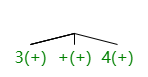

---
author:
- Nick Satriano, Yang Hong, Jimmy Zhu, Per Astrom
date: 2022-10-22
title: "SpaceMath: Project Progress Report"
---

1.  **Overview**\
    As technology has rapidly evolved, many aspects of everyday life
    have become deeply entrenched in modern computers. The internet has
    enabled near-instant communication and is the most effective tool
    for information distribution, becoming increasingly accessible with
    the mass production of smartphones and laptops. As a result, the
    education system has modernized, utilizing online resources to
    distribute course material, upload assignments, and turn in
    homework. Students have adapted to the modern online learning
    environment, often choosing to forgo handwritten work in exchange
    for the convenience of typing. Though education has improved in many
    regards through the use of technology, a new issue has arisen: the
    lack of a fast, convenient method to insert mathematical notation in
    digital documents. The current standard is the language LaTex, which
    requires the user to type out precise formatting rules that are
    difficult to remember and tricky to write correctly. For example, to
    write the equation $$\int_{a}^{b} x^2 \,dx$$ with LaTex, a person
    would have to type: ` \[ \int_{a}^{b} x^2 \,dx \]`

    Neither the slashes, the brackets, nor the comma are intuitive to
    include (unless one has learned them by heart) as these are not part
    of the visible output, they are just formatting rules.

    On the other end of the spectrum are graphical user interfaces with
    on-screen buttons (such as a smartphone calculator application),
    which are easy to use but far too slow and cumbersome for longer
    inputs. It would not be practical to write a textbook in this way,
    for instance. It also requires special buttons that cannot be found
    on a standard keyboard, and few GUIs have more than the most basic
    mathematical symbols.

    Our goal with SpaceMath is to make the simplest system possible for
    typing mathematics which a computer can understand and format. As
    our client, Dr. Farmer, put it: "Don't force the author to write
    what they don't need to". Using SpaceMath to output the same
    equation as above, the user may simply type:
    `integral from a to b x^2 dx`

    The SpaceMath form is more accessible for the user and transmits the
    actual meaning of the equation without formatting "noise".

    If the user get proficient to SpaceMath and knows more about the
    keywords, (s)he can type `int_a^b x^2 dx` instead. We may see that
    this form is similar to the Latex input, but much shorter and thus
    easier for the user to view. Therefore, we may see SpaceMath devoted
    to be more accessible and more efficient than LaTeX in simple math
    equations type-ups.

2.  **Current Status of the Project**\
    We have had two team meetings with our client, Dr. Farmer, thus far.
    During our first progress report meeting, we worked with Dr. Farmer
    to define standards for some ambiguous use cases, more specifically
    how SpaceMath should interpret these input strings:

    1.  `1/2+3`

    2.  `1/(2+3)(4+5)`

    3.  `sinx`

    4.  `sinh`

    5.  `rootN(M)`

    6.  `sqrtM`

    7.  `iso or isomorphic`

    We concluded that in the first two cases, if there is a lack of
    space before and after the "+" operator in "2+3", or in the
    second case in between the two multiplied terms "(2+3)(4+5)", then
    the entire term should be placed in the denominator. If there is a
    space, then the added or multiplied term will be represented outside
    of the fraction (becoming its own term).

    In the third and fourth case, we concluded that "sinh" should be
    interpreted as hyperbolic sine, and as a result, "sinx" must not be
    interpreted as "sine of x". Instead, users must include a space
    after typing "sin" or "sine" in order to properly input the trig
    function.

    For cases 5 and 6, we concluded that users should be able to input
    roots using the form "rootN(M)", where N is interpreted as the index
    of the root, and M is interpreted as the radicand. For handling
    square roots, like in case 6, we will allow users to input the form
    "sqrtM", which will be interpreted as square root of M.

    Lastly, we discussed how keyword operators should be handled. We
    decided that it would be less intuitive for users if spaces were
    interpreted as valid input in multiple character operators like
    "divided by", and as a result we are limiting these operators to be
    simple, spaceless strings. As with case 7, we decided that users
    will be able to input strings like "iso" or "isomorphic", which will
    allow multiple user input cases for non-standard operators, most of
    which are not found on common keyboards. Overall, these resolutions
    did not massively alter the build of our product.
    **Simple Demo**\
    \
    **Testing the Output with MathJax**\
    

3.  **System Design**\
    In this section, we'll introduce the process of how our program can
    translate SpaceMath texts into LaTex, together with the data
    structures and main algorithms used in the process.\
    **Programming Tools and Technologies**\
    We choose to implement SpaceMath in JavaScript, for the following
    reasons:

    1.  SpaceMath is aimed to be used in web applications and Javascript
        programs, being "the programming language of the web" can easily
        be inserted in HTML text with \<script\> tags and makes it
        straightforward to manipulate HTML elements, such as
        user-inputted text.

    2.  We considered TypeScript - a strictly typed version of
        JavaScript and a worthy alternative - however, JavaScript has
        less syntax (and thus a lower learning curve) and is more than
        sufficient for the scope of our project. With the simplicity of
        both our input data (nothing but strings) and stored data (maps
        containing mostly strings) there is little need for strict type
        checking.

    **Dictionary**\
    Before introducing the real algorithm, we first need to introduce
    the structure in which we store our data. We have a dictionary file
    which contains the information of keywords that are allowed in
    SpaceMath.

    There are many possible ways of representing mathematical symbols,
    we could construct objects internal to the code or store it as text
    in external files, such as in CSV format. We decided to use
    JSON-format, a lightweight and readable standard that uses simple
    map-format to store strings and numbers. It is more general and
    hence more flexible and adaptable to change and extension than
    creating specific class-objects. Whereas class-objects can only be
    used in functions that specifically support them, JSON data
    structures, being simple maps, can be used in all functions that .
    JSON is also very well-supported in JavaScript (being JavaScript
    Object Notation). An example of how we structure a mathematical
    symbol like:\
    `"+": {`\
    `  "alternative": ["plus"],`\
    `  "type": "operator",`\
    `  "priority": 10,`\
    `  "rule": {"2,3": "#1 + #3"}`\
    `}`\

    -   **"alternative"** is suggesting the other ways the user can type
        in this keyword. We will make use of it when we introduce
        translation in the future.

    -   **"type"** is indicating which category the keyword lives in. We
        currently support types "operator" (+ $-$ \_̂), "relation" ($>$
        $=$ $<$), and "symbol" (alpha, $beta$, $pi$). Each category
        shares the same parsing rule.

    -   **"priority"** is indicating the priority of the symbol when we
        are applying parsing. We mainly follow the PEMDAS (Parenthese,
        Exponentiation, Multiply, Divides, Add, Subtract) rule for
        priorities, and have appropriate priority for other symbols,
        assisting with consistent and correct translation.

    -   **"rule"** stands for replacement rule and will be used in the
        combination process. It is a map in which the keys would be the
        possible tree node structures it can live in, and the
        corresponding value being the corresponding replacement rule for
        that situation. We will explain more details about it in the
        introduction of the combination process.

    **BNF grammar to split text & math**\
    The user input may contain pure text (not surrounded by the
    delimiters) and math text (surrounded by the delimiters). The
    algorithm first separates these parts, sends all math parts to the
    next step to convert them to LaTeX, then combines them back after
    the math parts are converted.\
    **Tree construction & priority**\
    We choose the tree structure to be the form storing information when
    we parse the math input as it can keep the information and is easy
    to combine back to a string. The information each treenode contains
    other than its position, parent and children are its "value", "key",
    and "pair". "value" is a parsed piece of the original string, "key"
    tells which keyword is used under its parent, and "pair" indicates
    if it needs to be surrounded by a pair of parentheses.

    We read the math string from left to right and construct the tree
    based on the keyword we find on the way. It would be complicated to
    introduce all the details in the process of parsing the string into
    a tree, so we will show the process by an example.\
    **Example:**\
    We'll show how the math string $(3+4)/pi + 3$ goes through the
    process of tree parsing as an example. In the example, we will
    denote each tree node in the form $x(y)$, in which $x$ is the value
    and $y$ is the key of that tree node.

    When we scan the string from left to right, the first important
    thing we noticed is the left parenthesis \"(\". We then find the
    corresponding right parenthesis of it. In-between these parentheses
    is "3+4". Therefore, we recursively call the tree construction
    function on "3+4".

    Constructing a tree for "3+4" is not difficult - we can easily
    find the keyword "+" and recognize that it is an operation. The
    operation needs an argument before and after it, and our only choice
    is "3" and "4". So the parse tree for "3+4" would be

    ::: center
    
    :::

    Now we put this tree into a holder variable and continue reading.the
    original string. After the right parenthese, the first keyword we
    find is "/", which is an operator. It pulls out the tree structure
    in the holder as its left argument, and simply takes the rest of the
    string as its right argument. Hence the tree we have for this step
    is

    ::: center
    
    :::

    (Note for the left subtree, it has a property value of "pair"
    indicating it should be surrounded by parenthesis).

    Our focus moves onto the rest of the string, which is $pi+3$. The
    first keyword here is the symbol $pi$. We just construct a simple
    tree for it:

    ::: center
    
    :::

    and then place it into the holder variable.

    The next keyword we met is "+". As it is an operator, it takes the
    pi tree as the left argument and 3 as the right argument.

    ::: center
    
    :::

    Notice that "$pi+3$" in the tree has a key of "/". Finding that the
    priority of "+" is less than "/", we notice that we need to adjust
    the order of the "+" siblings. We attempt to move to the parent, but
    that is already the child of the root. Thus we say the "+" should
    just live there, so we leave the left argument there, and move the
    "+" together with its right argument to the higher layer. After we
    made the adjustment, the tree would look like:

    ::: center
    
    :::

    And we have exhausted the string, so that would be how the final
    parse tree looks like.\
    **Tree Combination**\
    After we parsed the tree successfully, we'll combine the tree back
    to a string. In this process, the replacement rules will work to
    make sure that the final string is a readable string in Latex that
    corresponds to the initial user input. Again, we use the previous
    example to show how tree combination works. Recall that the tree
    looks like

    ::: center
    
    :::

    For combination, we call the combine() function on the root node.
    Combine first call on all its children, then deal with the rest of
    the function, hence all leaves are operated the first.

    We do nothing if the node is a leaf. Otherwise, we attempt to apply
    the rule. Let's focus on the (/) on the left. All its children have
    the key "+". The rule for "+" is `{"2,3": "#1 + #3"}`. In
    English words, that means "If the keyword is the 2nd of 3 sibling,
    then replace the branch into \"`#1 + #3`\", in which `#i` means the
    content of the ith sibling". Hence, the branch would be replaced by
    "3+4". Recall that this branch has a parenthese property, so we
    need to have the parenthese there. (Interaction between operators &
    parenthese will be added later). Hence the tree now looks like

    ::: center
    
    :::

    The next thing we deal with is the other (/), in which the only
    child is pi. Its rule is `{"1,1": "\\pi"}`, so it will be directly
    replaced by `\pi`.The tree now looks like this:

    ::: center
    
    :::

    Now, as all its children have finished the combine() function, we
    can work on the (+). The "/" works just like "$+$", only with a
    different replacement rule: `{"2,3": "\\frac{#1}{#3}"}`. Applying
    that, we have

    ::: center
    
    :::

    The only thing left is the root and it is not hard to do that
    combination. Hence the final string we end up with is
    `\frac{(3+4)}{\pi}+3`, which is the output we are looking for to
    input `(3+4)/pi + 3`.\

4.  **Reflection on Challenges**\
    One major challenge we are having is to allow our program to be more
    expandable so our client can further add new keywords into the
    dictionary without changing any code. We decided to make the
    structure abstract and reduce the components of hard-coded
    processing. In other words, program to abstractions (not
    concretions). This means that we should only have hard-coded content
    for specific keywords (like parenthesis, the sup & subscript, etc.).
    All other symbols should fall in some standard that can be covered
    by our dictionary structure.

    Another challenge is that as the code expands, it becomes more
    difficult to reason about. making it hard to change and maintain. We
    may have to refactor the code at some point, to make it possible for
    Dr. Farmer to maintain the project in the future and make it easy to
    further extend.

    A difficulty with using scrum is that it takes time to use, and can
    feel like extra administrative work at times, getting in the way of
    the real work. But it is good practice for keeping track of things
    and making sure that progress goes in the right direction.\

5.  **Plan for the Rest of the Semester**\
    Here is a list of future works needs to be done:

    -   Interaction of parenthese with functions/operators (`/, ^, _`
        etc may absorb the outermost pair of parentheses of its
        arguments)

    -   implementation of functions

    -   Implementation of multi-line sentence structure (cases, itemize,
        linear system)

    -   Implementation of the translate Hashtable (so alternatives can
        be recognized in parsing), translation step (so all nodes are in
        standard form when combining)

    -   Add in more keywords

    -   Have specific rules for keywords which can be in multiple types:
        "<" for instance, it is a "relation" when surrounded by space,
        but the symbol "`\langle`" if not. This may lives in M2Tree
        totally, or maybe we want to adjust the dictionary structure.

    -   Add in the small space " " in Latex to indicate the existence of
        space multiplication

    We plan to allow our program to support these functionalities listed
    above. After we have reached a stable demo, we may also apply a
    wider range of test cases in order to determine if we can
    refine/expand the depth of accepted input.
